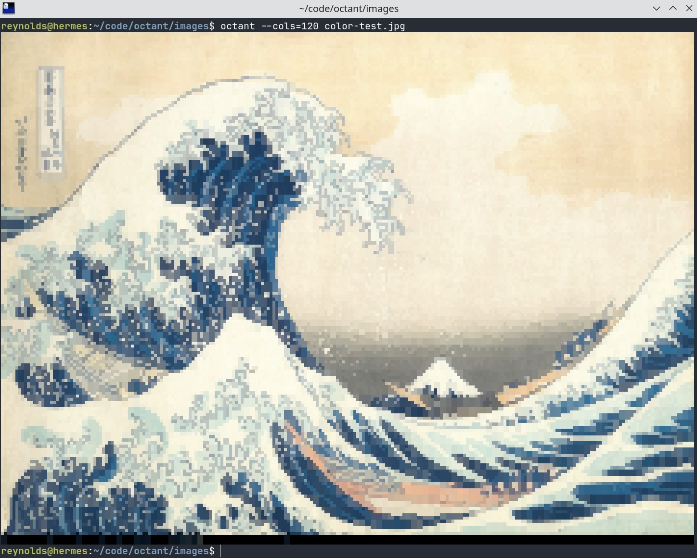
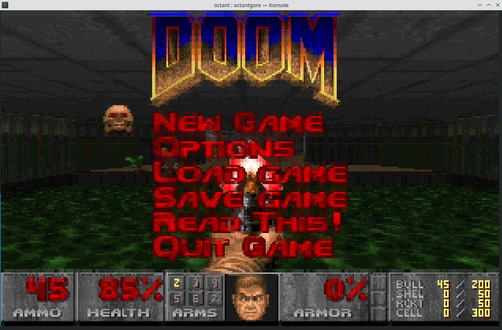
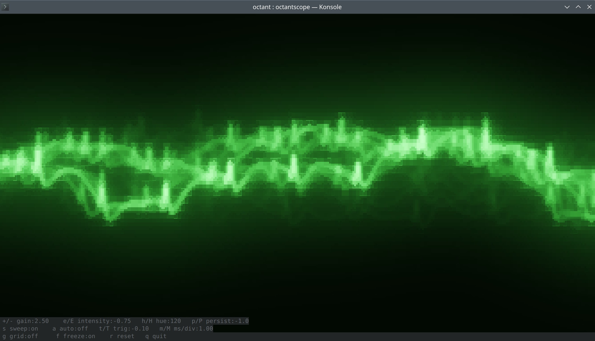
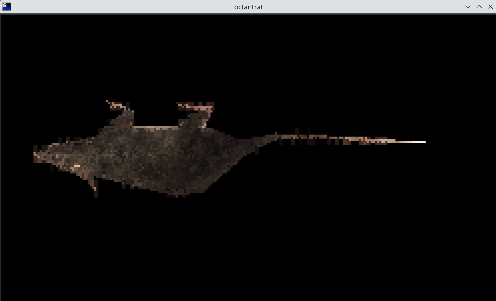
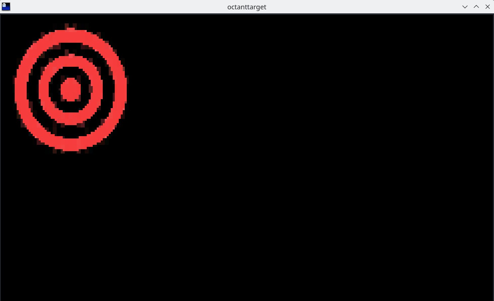

# Octant

Octant is a Go CLI tool and library for rendering images and GIF animations in the terminal using Unicode 16.0
[octant block characters](https://www.unicode.org/charts/PDF/Unicode-16.0/U160-1CC00.pdf)
with ANSI 24-bit truecolor.

Each terminal cell is treated as a **2-column x 4-row pixel grid**. The 256 possible fill patterns map to Unicode block characters — the 230 octant characters in `U+1CD00`–`U+1CDE5` plus legacy block-drawing characters for the patterns they already cover. This gives twice the horizontal and four times the vertical resolution of plain half-block rendering at the cost of each cell being limited to two colors.

## Prerequisites

Your terminal must use a font that includes the Unicode 16.0 octant characters or already have these characters included as "drawing characters". These are new enough (circa ~2024) your system may not ship with them. 
[Cascadia Code](https://github.com/microsoft/cascadia-code/releases) includes these as do most recently updated Nerd Fonts

Most terminals optimize for character readability first and have special rules for "drawing characters" which disable particular legibility related rendering techniques so that the edges of drawing characters line up perfectly with the character grid.

What is considered a drawing character varies between terminal. [Ghostty](https://ghostty.org/) appears to render all octant perfectly, with [WezTerm](https://wezterm.org/index.html) and [Rio](https://rioterm.com/) in 2nd and 3rd place respectively. Octant will look ok, in most terminals as long as the octant characters have some valid representation.

## Example Applications

### octant — image and GIF viewer

Renders images and GIF animations in the terminal. See the [octant README](cmd/octant/README.md) for full usage and flags.

```shell
go install github.com/reynoldsme/octant/cmd/octant@latest
```



### octantgore — DOOM in the terminal

Runs DOOM in the terminal. Requires a DOOM WAD file. See the [octantgore README](cmd/octantgore/README.md) for full usage and keyboard controls.

**Requires:** `libasound2-dev` (Debian / Ubuntu: `sudo apt install libasound2-dev`)

```shell
go install github.com/reynoldsme/octant/cmd/octantgore@latest
```



### octantscope — oscilloscope in the terminal

A real-time XY phosphor oscilloscope with Gaussian beam glow, phosphor persistence, and a CRT graticule. See the [octantscope README](cmd/octantscope/README.md) for full usage, flags, and keyboard controls.

**Requires:** `portaudio19-dev` (Debian / Ubuntu: `sudo apt install portaudio19-dev`)

```shell
go install github.com/reynoldsme/octant/cmd/octantscope@latest
```



### octantrat — rotating 3D rat



Renders a rotating 3D rat with a UV-mapped texture. See the [octantrat README](cmd/octantrat/README.md) for full usage and keyboard controls.

```shell
go install github.com/reynoldsme/octant/cmd/octantrat@latest
```

### octanttarget — interactive image display



Displays an image that can be repositioned and scaled interactively via keyboard or a JSON HTTP API. See the [octanttarget README](cmd/octanttarget/README.md) for full usage, flags, and API reference.

```shell
go install github.com/reynoldsme/octant/cmd/octanttarget@latest
```

---

## As a Library

Note: Currently this is a silly vibe coded experiment. Don't expect API stability. I wouldn't recommend actually using this for anything you expect to depend on.

Import the root package:

```go
import "github.com/reynoldsme/octant"
```

### Rendering a static image

```go
f, _ := os.Open("photo.jpg")
img, _, _ := image.Decode(f)
img = octant.Scale(img, 0) // 0 = auto-detect terminal width
octant.Render(img, os.Stdout)
```

Use `octant.RenderMono` for monochrome output.

### Rendering to a PNG (for testing)

```go
err := octant.RenderToPNG(img, "out.png", false)
```

### Animated output — the `Terminal` type

`Terminal` is a stateful renderer that overwrites the previous frame in place,
making it suitable for real-time animation:

```go
t := &octant.Terminal{W: os.Stdout}

for _, frame := range frames {
    t.DrawFrame(frame) // overwrites previous frame with cursor-up sequences
    time.Sleep(100 * time.Millisecond)
}
```

`Terminal.DrawFrame` accepts `*image.RGBA`, which is the same type and signature
used by [Gore](https://github.com/AndreRenaud/Gore)'s `DoomFrontend` interface —
see `octantgore` below for a complete example.

### API reference

```go
// Render renders img as octant blocks with 24-bit ANSI color to w.
func Render(img image.Image, w io.Writer)

// RenderMono renders img as monochrome (1-bit dithered) octant blocks to w.
func RenderMono(img image.Image, w io.Writer)

// Scale resizes img proportionally to fit maxCols terminal columns.
// maxCols=0 auto-detects the terminal width.
func Scale(img image.Image, maxCols int) image.Image

// RenderToPNG writes the octant rendering of img to a PNG file.
func RenderToPNG(img image.Image, outPath string, monochrome bool) error

// ComposeGIFFrames composites all GIF frames respecting disposal methods,
// returning one fully-composited image per frame.
func ComposeGIFFrames(g *gif.GIF) []image.Image

// Terminal is a stateful renderer for real-time animation.
type Terminal struct {
    W       io.Writer // destination (defaults to os.Stdout)
    MaxCols int       // 0 = auto-detect
    Mono    bool      // monochrome mode
}

// DrawFrame renders img, overwriting the previous frame in place.
func (t *Terminal) DrawFrame(img *image.RGBA)
```

---

DOOM is a registered trademark of id Software LLC, a ZeniMax Media company.
This project is not affiliated with or endorsed by id Software or ZeniMax Media.
